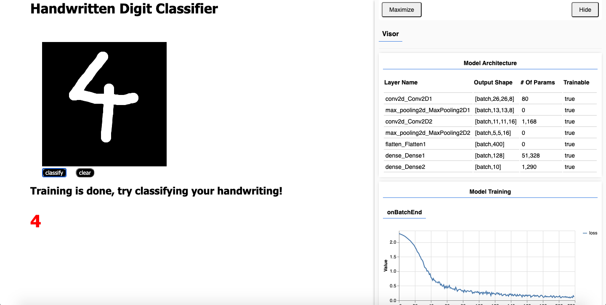

# Handwritten Digit Classifier
A web app which uses TensorFlow.js to train a model on the MNIST dataset and then classify handwritten digits.
Also uses tfjs-vis to visualize training. Currently only works for desktop browsers.

## Screenshot

## To Run
- Clone into repo
- Run `npm i serve` or some other alternative
- Visit `localhost:5000` and wait for training to complete
- Draw your digits and see them get classified